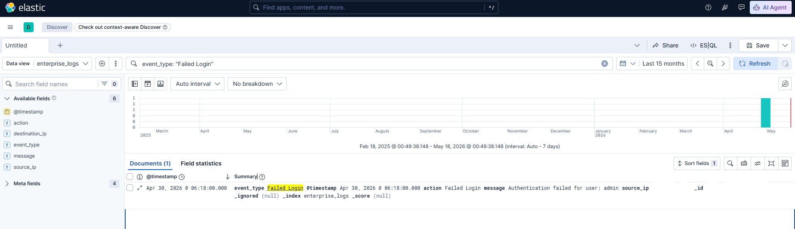
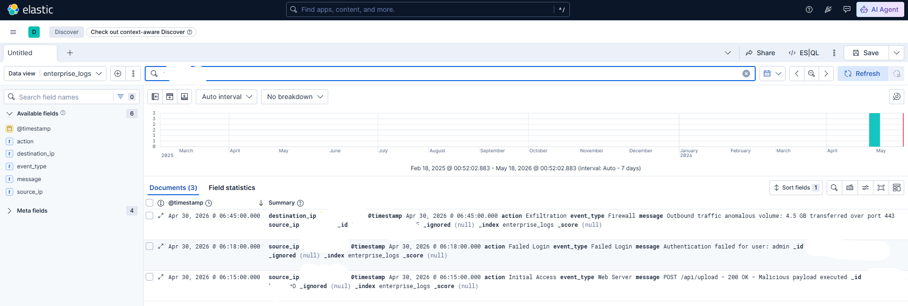
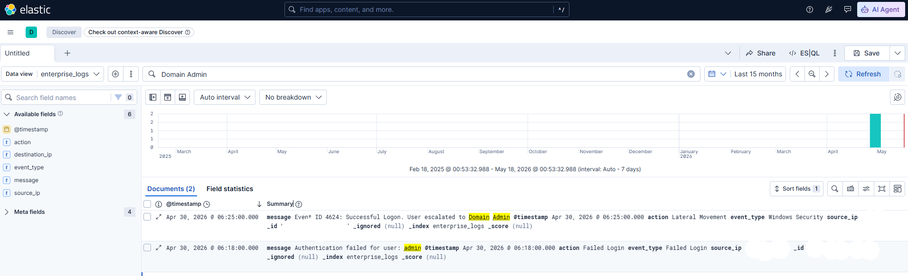
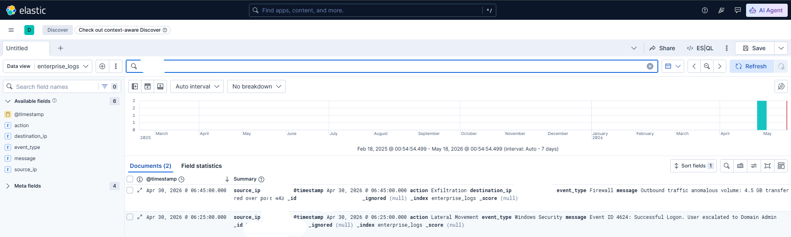

# 📸 S30: The Central Nervous System — Evidence of Log Correlation

This directory contains the technical evidence for the SIEM log correlation and multi-stage attack timeline reconstruction across the TitanCorp enterprise network space. These artifacts document the defensive "kill chain" identification, transitioning from initial credential abuse detection to lateral movement tracking and data exfiltration quantification.

---

### 🛡️ Phase 1: The Initial Indicator (Failed Login Detection)
**File:** `01_s30_failed_login.png`  
**Target:** Centralized Elasticsearch/Kibana SIEM Dashboard (`http://localhost:5601`)

* **Vulnerability / Event Type:** Password Brute-Forcing / Credential Abuse.
* **Action:** Configured the `enterprise_logs*` index pattern and queried for `event_type: "Failed Login"`.
* **Result:** Isolated a critical authentication failure event occurring on **Apr 30, 2026 @ 06:18:00.000** targeted at the user account `admin`.
* **Significance:** Flagged the precise timestamp of the threat actor's initial access profiling attempt, surfacing an early operational indicator of compromise (IoC).

---

### 🧪 Phase 2: Pivot Tracking & Threat Discovery (Full Lifecycle Correlation)
**File:** `02_s30_attack_lifecycle.png`  
**Target:** Centralized Elasticsearch/Kibana SIEM Dashboard (`http://localhost:5601`)

* **Vulnerability / Event Type:** Multi-Stage Attack Chain Aggregation.
* **Action:** Cleared specific filters to view the full temporal scope of compromised actions clustered around the incident window.
* **Result:** Correlated the three core milestones of the breach within a single pane: initial payload execution on the Web Server (`06:15:00`), subsequent failed administrative login tracking (`06:18:00`), and final high-volume network egress (`06:45:00`).
* **Significance:** Provided the complete investigative baseline required to understand the speed, scope, and ultimate objective of the network compromise.

---

### 🔑 Phase 3: Tracking Lateral Movement (Privilege Escalation)
**File:** `03_s30_lateral_movement.png`  
**Target:** Centralized Elasticsearch/Kibana SIEM Dashboard (`http://localhost:5601`)

* **Vulnerability / Event Type:** Compromised Account Exploitation / Lateral Movement.
* **Action:** Searched the unified logging index for the query string `Domain Admin` to inspect Windows Security logs for anomalous access tokens.
* **Result:** Discovered a successful account escalation event (**Event ID 4624: Successful Logon**) at **Apr 30, 2026 @ 06:25:00.000**, showing a user session escalating directly to `Domain Admin` privileges.
* **Significance:** Proved that the threat actor successfully pivoted from the web tier into the core enterprise domain, moving horizontally across internal networks.

---

### 💰 Phase 4: Quantifying the Exfiltration (Firewall Egress Analysis)
**File:** `04_s30_data_exfiltration.png`  
**Target:** Centralized Elasticsearch/Kibana SIEM Dashboard (`http://localhost:5601`)

* **Vulnerability / Event Type:** Data Exfiltration / Network Egress Anomalies.
* **Action:** Analyzed firewall traffic streams following the privilege escalation window to locate anomalous outbound traffic volumes.
* **Result:** Captured a critical outbound firewall record at **Apr 30, 2026 @ 06:45:00.000** showing an **"Outbound traffic anomalous volume: 4.5 GB transferred over port 443"**.
* **Significance:** Confirmed the crown jewel of the incident—the attacker successfully exfiltrated 4.5 GB of sensitive corporate data over an encrypted tunnel, defining the true material impact of the breach.

---

### 📝 Timeline & Remediation Summary
As detailed in `attack_timeline.csv`, the following immediate network hardening and visibility measures are required:
1. **Initial Access Hardening:** Enforce strict **Account Lockout Policies** and mandatory **Multi-Factor Authentication (MFA)** on all administrative entry pathways to defeat automated brute-force scripts.
2. **Privilege & Group Auditing:** Restrict `Domain Admin` delegation using the principle of least privilege, ensuring credential caching is disabled on user-facing servers via protected user groups.
3. **Egress Network Filtering:** Implement strict **Data Loss Prevention (DLP)** controls and behavioral network analytics on firewall edges to alert on or throttle massive outbound file transfers over common ports like HTTPS (443).
