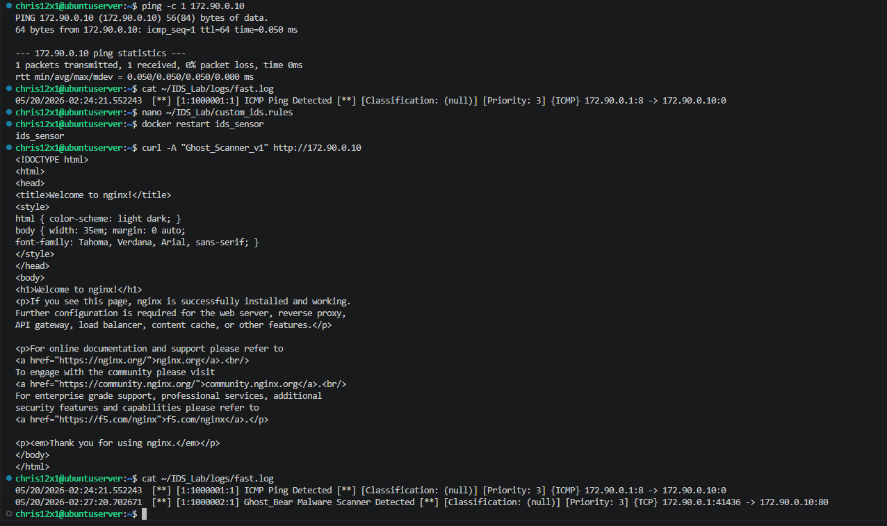

# 📸 Week 11 Perimeter Defense & Intrusion Detection — Technical Evidence

This directory contains the verified technical evidence demonstrating the successful deployment, testing, and validation of our multi-layered defense-in-depth network architecture. 

---

### 🚨 Network Intrusion Detection & Custom Signature Verification
**File:** `suricata_ids_verification.png`  
**Target:** Combined Suricata IDS Unified Alert Engine Logs (`fast.log`)

* **Defensive Mechanism:** Multi-Vector Network Telemetry Verification.
* **Action:** Executed a comprehensive log extraction (`cat ~/IDS_Lab/logs/fast.log`) to inspect sequential network events across multiple simulated attack windows.
* **Result:** Successfully captured both the Layer-3 discovery fingerprint (`[1:1000001] ICMP Ping Detected`) and the Layer-7 malicious application scanner execution (`[1:1000002] Ghost_Bear Malware Scanner Detected`) inside a single pane of glass.
* **Significance:** Confirmed the functional integrity of the custom signature engine database, proving that transport layers are completely monitored, parsed, and recorded accurately in real time.

---

### 🛡️ Defensible Remediation Guidelines Tested
Based on the architectural successes validated in this log evidence, the following defense-in-depth principles are fully realized:
1. **Network Layer Isolation:** Baseline network sweeps are immediately flagged, allowing for automated firewall rules to dynamically block scanning sources before exploitation begins.
2. **Signature Database Hygiene:** Custom tracking patterns inside our Suricata architecture successfully identify specific text strings matching malicious User-Agents and threat actor tooling frameworks.
3. **Unified Logging Integrity:** Centralizing alerts into the fast log layout provides clear chronological visibility, making it an actionable telemetry feed for future SIEM pipeline ingestion.
