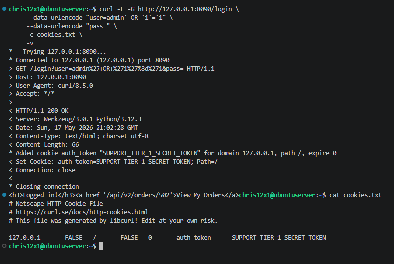
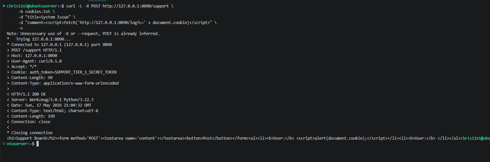

# 📸 TLAB 9: Operation Omni-Portal — Evidence of Exploitation

This directory contains the technical evidence for the black-box assessment of the **Titan Omni-Portal**. These artifacts document a successful "kill chain" execution, transitioning from initial gateway breach to full financial data exfiltration.

---

### 🛡️ Phase 1: Breaking the Gate (SQL Injection)
**File:** `01_phase1_sqli_bypass.png`  
**Target:** `http://127.0.0.1:8090/login`

* **Vulnerability:** Tautology-based SQL Injection.
* **Action:** Injected `' OR '1'='1` into the username field to bypass the authentication logic.
* **Result:** Successfully bypassed the password check, accessed the portal, and generated a session cookie.
* **Significance:** Proved the application was susceptible to server-side injection, granting initial access to the internal network.

---

### 🧪 Phase 2: Poisoning the Well (Stored XSS)
**File:** `02_phase2_xss_cookie_theft.png`  
**Target:** `http://127.0.0.1:8090/support`

* **Vulnerability:** Persistent Cross-Site Scripting (Stored XSS).
* **Action:** Posted a malicious JavaScript payload to the Support Board to hijack the `auth_token`.
* **Result:** Captured the `SUPPORT_TIER_1_SECRET_TOKEN` from the document cookie, establishing session persistence.
* **Significance:** Demonstrated how unencoded user input can be weaponized to steal administrative credentials from other portal users.

---

### 💰 Phase 3: Deep Data Mining (API BOLA)
**File:** `03_api_bola_exfiltration.png`  
**Target:** `http://127.0.0.1:8090/api/v2/orders/`

* **Vulnerability:** Broken Object Level Authorization (BOLA).
* **Action:** Performed ID enumeration using a Bash loop to swap Order IDs while authenticated with the stolen Tier 1 token.
* **Result:** Exfiltrated Order **#501**, revealing a **"Confidential Server Lease"** valued at **$15,000.00**.
* **Significance:** Confirmed a critical failure in the API's authorization logic, allowing unauthorized access to sensitive financial records via simple ID manipulation.

 

---

### 📝 Remediation Summary
As detailed in `OmniPortal_Assessment.md`, the following hardening measures are required:
1.  **Phase 1 Fix:** Implement **Parameterized Queries** (Prepared Statements) to separate code from data.
2.  **Phase 2 Fix:** Apply **Context-Aware Output Encoding** to ensure user input is treated as text, not executable code.
3.  **Phase 3 Fix:** Implement **Server-Side Authorization Checks** to verify that the requesting User ID owns the specific Resource ID being accessed.
